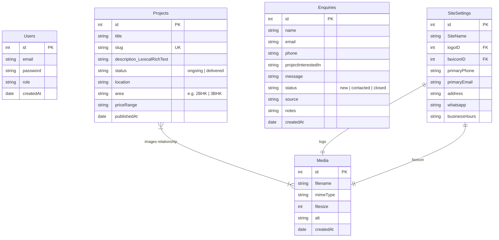
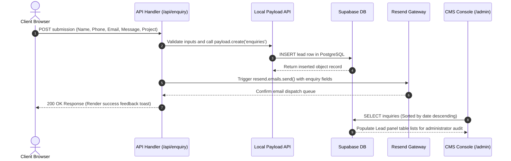

# PGRO System Design Blueprint

This document outlines the system architecture, core features, database schema, and data flows of the **PGRO** premium real estate platform.

---

## 1. System Architecture

The platform is designed around **Next.js 16 (App Router)** and **Payload CMS**, configured in a unified monolith deployed on **Vercel**. All data is persisted in a **Supabase PostgreSQL** instance, and transactional emails are sent via **Resend**.

### Component Architecture

```mermaid
graph TD
    User["Client Browser (Desktop/Mobile)"]
    
    subgraph Vercel["Vercel Cloud Monolith"]
        NextFront["Next.js Frontend (React 19)"]
        NextAPI["Next.js Route Handlers (API /enquiry)"]
        PayloadAdmin["Payload CMS Admin UI (/admin)"]
        LocalPayloadAPI["Local Payload SDK API"]
    end
    
    subgraph Services["External Core Services"]
        Supabase["Supabase (PostgreSQL Database)"]
        Resend["Resend (Email Gateway)"]
    end

    User -->|HTTPS Requests| NextFront
    User -->|Fills forms / Opens chat| NextAPI
    User -->|Manages database| PayloadAdmin
    
    NextFront -->|Fetches projects/settings| LocalPayloadAPI
    PayloadAdmin -->|CRUD operations| LocalPayloadAPI
    NextAPI -->|Creates lead| LocalPayloadAPI
    
    LocalPayloadAPI -->|SQL queries (Prisma/Postgres)| Supabase
    NextAPI -->|SMTP payload| Resend
```

---

## 2. Core Platform Features

| Feature | Technologies | Functional Details |
| :--- | :--- | :--- |
| **Dynamic Listings** | Next.js Server Components, Payload local API | Queries the database directly inside server-side page renders, optimizing SEO indexing and performance. Includes dynamic routing for individual details (`/projects/[slug]`). |
| **UX Enhancements** | Lenis, Framer Motion, GSAP | Unified Lenis smooth-scrolling wrapper. Timelines in GSAP coordinate horizontal project showcases on the landing page, and Framer Motion handles drawer/modal transitions. |
| **Lead Capture** | React 19 Client components, Resend API | Connects a validated registration form to Next.js API routes, storing leads in the DB and triggering Resend alerts to the admins. |
| **Private Chat Advisor** | React state, Framer Motion | Slides out from the right on chatbot badge triggers. Provides dynamic replies regarding ongoing developments, completed status, WhatsApp routes, and enquiries. |
| **SEO Optimization** | Next.js Metadata API, sitemap.ts, robots.ts | Dynamically parses sitemaps based on active CMS project slugs, injecting JSON-LD structured data block snippets on relevant project pages. |
| **Payload CMS Portal** | Next.js dynamic routing | Serves a built-in admin dashboard at `/admin` to handle user permissions, media storage, and project content editing. |

---

## 3. Database Schema Blueprint

The database maps to PostgreSQL tables managed via Prisma. The following schema represents the custom collections configured in the CMS:



---

## 4. Enquiry Data Flow

The lifecycle of an enquiry submission flows as follows:



---

## 5. Production Optimization & Deployment Details

- **Database Connection Pools:** Payload communicates with Supabase via `@payloadcms/db-postgres` which leverages standard Postgres connection pooling, bypassing Spanner or serverless concurrency exhaustions.
- **Incremental Static Regeneration (ISR):** Project list routes are statically optimized, and individual projects use `revalidate = 60` in Next.js, allowing pages to rebuild on demand in the background as CMS data updates.
- **Edge Assets:** User-uploaded media images are stored and optimized via next/image and serverless pipelines.
